## k-means-And-DTW原理及算法介绍

Clustering and fitting of time series based on DTW and k-means

[TOC]

### 一、DTW原理介绍

#### 1.1 传统k-mean算法及存在的问题

简单写一个测试数据（代码里的`get_draw()`函数）：

```python
# 展示一下如何使用plot绘图。
def get_draw():
    x = np.linspace(0, 50, 100)
    ts1 = pd.Series(3.1 * np.sin(x / 1.5) + 3.5)
    ts2 = pd.Series(2.2 * np.sin(x / 3.5 + 2.4) + 3.2)
    ts3 = pd.Series(0.04 * x + 3.0)
    ts1.plot()
    ts2.plot()
    ts3.plot()
    plt.ylim(-2, 10)
    plt.legend(['ts1', 'ts2', 'ts3'])
    plt.show()
```

`ts1`是窄的正弦波，`ts2`是宽的正弦波，`ts3`是直线，可以从图看出：


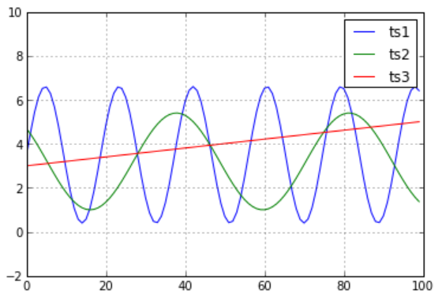


如果采用欧拉距离进行聚类计算，则会得到`ts3`比`ts2`更接近`ts1`的结论。但是肉眼看并非如此。

因此学者提出``DTW``距离。

#### 1.2 动态时间规整（Dynamic Time Warping, `DTW`）

动态时间规整算法，故名思议，就是把两个代表同一个类型的事物的不同长度序列进行时间上的“对齐”。

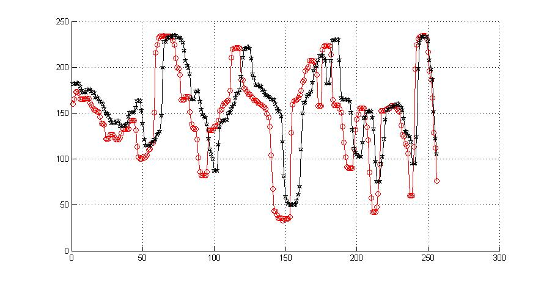

比如``DTW``最常用的地方，是在语音识别中，同一个字母，由不同人发音，长短肯定不一样，把声音记录下来以后，它的信号肯定是很相似的，只是在时间上不太对整齐而已。所以我们需要用一个函数拉长或者缩短其中一个信号，使得它们之间的误差达到最小。这篇博文给了比较好的解释[^1]：

>   ##### 1、动态时间规整（`DTW`）基本思想
>
>   动态时间规整：Dynamic Time Warping（`DTW`），是一种衡量两个离散时间序列相似度的方法，主要特点是在序列长度不一或x轴无法完全对齐的情况下，用满足一定条件的的时间规整函数描述两者之间的时间对应关系。`DTW`算法在各种模式匹配任务中被广泛使用，如语音识别、动态手势识别和信息检索等中。
>
>   假设下图两个时间序列对应的是同一个单词的发音（实则只是示意图，只是为了便于理解）。
>
>   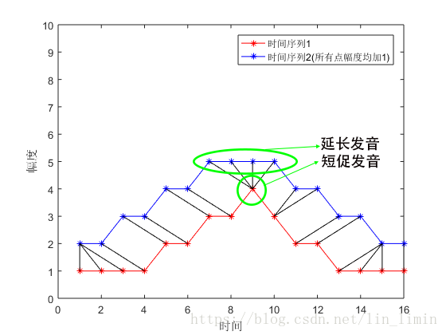
>
>   图1↑
>
>   
>
>   `图1`里黑色的线表示两个时间序列的相似的点（用幅度差异刻画时间序列点的相似性，幅度差异越小，相似性越高）。
>
>   由于不同人语速上存在差异，某些人可能会把字母`A`发得很长（延长发音），某些人却发得较短（短促发音），这样同一个字母展现出来的时间序列上就存在着很大的差异，如图中绿色圈出的时间波形所示。
>
>   因此就需要对原始的两个时间序列进行规整，即对时间序列进行延伸和缩短，提取两个时间序列的相似性，从而对语音进行识别。
>
>   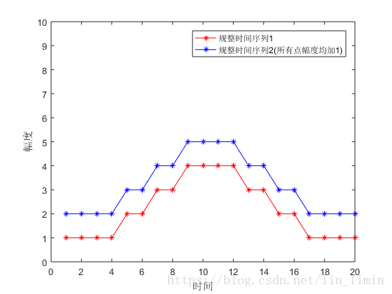
>
>   图2↑
>
>   
>
>   `图2`对应的就是原始时间序列的规整后的结果。
>
>   所以动态时间规整的思想就是：通过对两个时间序列点之间的相似性进行比较（图1黑线），对原始时间序列进行拉伸到相同时间长度（原始时间序列的长度很可能不一致），进而比较两个时间序列的相似性。
>
>   动态时间规整要解决的问题就是，找到一条最优的规整路径：
>
>   $W = {\varpi_1},{\varpi_2}...{\varpi_k}，其中{\varpi_k} = (i,j)$，
>
>   即认为`时间序列1`的第`i`个点和`时间序列2`的第`j`个点是相似的。
>
>   所有相似点的距离之和作为规整路径距离，用规整路径距离来衡量两个时间序列的相似性。规整路径距离越小，相似度越高。
>
>   主要步骤如下：
>
>
>   1. 假定两个待匹配的离散数据分别为 $A = {A(1), A(2), …, A(m)}$和 $B = {B(1), B(2), …, B(m)}$，其中下标为1的元素为序列的起点，下标为 $m$ 或者 $n$ 的元素为序列终点。
>   2. 采用了“动态规划”的方法对齐`A,B`两个序列.首先构造一个$m × n$的矩阵，用于存放两序列点对点之间的距离（一般可使用欧氏距离），距离越小表明两点之间的相似度越高。
>   3. 该部分是DTW算法的核心。把$m × n$的矩阵看成一个网格，算法的目的可总结为寻找一条通过此矩阵网格的最优路径，该路径通过的网格点即为两个离散序列经过对齐后的点对。
>   4. 找到最优路径后，DTW算法定义了一个归整路径距离(Warp Path Distance)，通过使用所有相似点之间距离的和，来衡量两个时间序列之间的相似性。
>
>   
>
>
>   ##### 2、动态时间规整（`DTW`）解释
>
>   假设原始时间序列为$X,Y$，它们的时间长度分别为$∣ X ∣和∣ Y ∣$。对于规整路径$W = {\varpi _1},{\varpi _2}...{\varpi _k}$，有：
>   $$
>   max(∣X∣,∣Y∣)≤k≤∣X∣+∣Y∣
>   $$
>
>   $k$表示两个序列最终被拉伸的长度。
>
>   规整路径必须从$ {\varpi _1} = (1,1)$开始，到$ {\varpi _k} = (\left| X \right|,\left| Y \right|)$结束，以保证$X$和$Y$序列的每个坐标点都出现一次。另外，规整路径${w_k} = (i,j)$中的$i$和$j$必须是单调递增的。
>
>   也就是说，路径要满足：
>
>   1、边界条件：$w_1=(1, 1)和W_k=(m, n)$。
>   2、连续性：如果$W_{k-1} = (i, j)$，那么对于路径的下一个点$w_k=(i^′,j^′)$需要满足：$(i^′ - i) \leq 1 和 (j^′-j) \leq 1$。因此只能和自己相邻的点对齐。这样可以保证序列A和B中的每个元素都在规整路径W中出现。
>   3、单调性：如果$W_{k-1} = (i, j)$，那么对于路径的下一个点$w_k=(i^′,j^′)$需要满足：$(i^′- i) \geq 0 和 (j^′ - j) \geq 0$。在这里需要假设A和B的顺序均是不可改变的。因此路径W在矩阵网格中的走势必须是随着时间单调递增的，如下图所示，整个过程是从矩阵网格的左下角出发，在右上角结束。
>
>   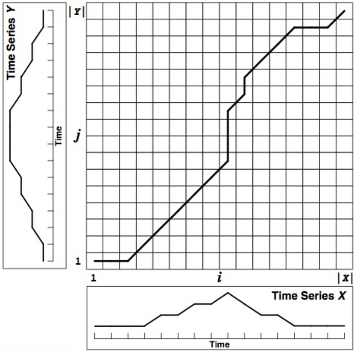
>
>   单调递增也可以写为：
>   $$
>   w_k = (i, j), w_{k+1} = (i^′, j^′)　　　　i≤i^′≤i+1, j≤j^′≤j+1
>   $$
>
>   所以如果路径已经通过了格点$(i, j)$，那么路径的下一个格点只能是$(i+1,j)，(i, j+1)，(i+1, j+1)$中的一种，如`图3`中绿色剪头所示。
>
>   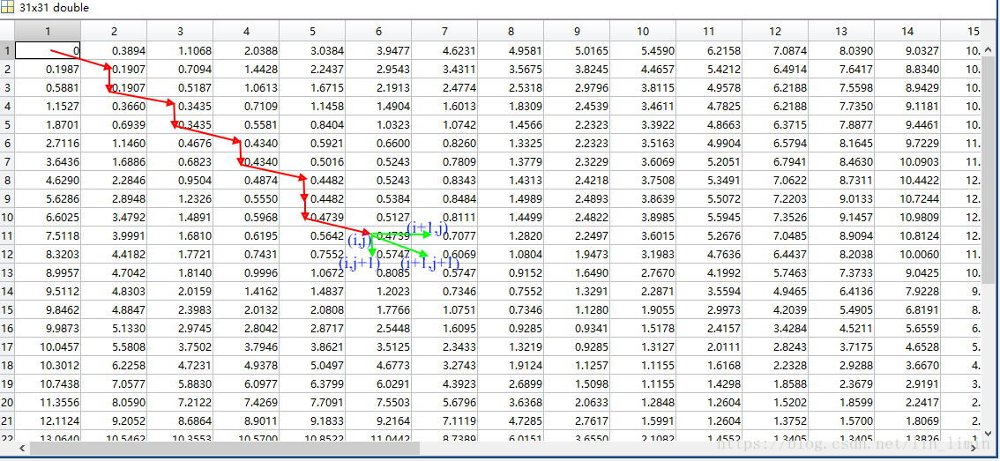
>
>   图3↑
>
>   
>
>   基于以上3个约束，规整路径的计算被简化为三种情况，或者说三个方向：
>
>   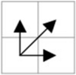
>
>   最后，需要定义一个累加距离`dist`，即从`(0,0)`点开始匹配两个序列A和B，每到一个点，之前所有的点计算的距离**都会累加**。到达终点`(n,m)`后，这个累积距离就描述了序列A和B的总体相似程度。
>
>   累积距离$dist(i,j)$可以表示成以下公式：
>
>   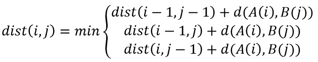
>
>   
>
>   所以对于路径规整距离矩阵$D ( i , j )$，有：
>   $$
>   D(i,j) = Dist(i,j) + \min \{ D(i - 1,j),D(i,j - 1),D(i - 1,j - 1)\} \tag{3}
>   $$
>
>   其中，
>
>   $Dist(i, j)$表示$X$序列第$i$个点与$Y$序列第$j$个点之间的距离（两个点的相似性）。 
>
>   $D(i, j)$衡量的是$X$序列前$i$个点与$Y$序列前$j$个点的相似性。 
>
>   最终的规整路径距离为$D(\left| X \right|,\left| Y \right|)$。
>
>   $D(\left| X \right|,\left| Y \right|)$的值越小，两个原始时间序列的相似性越大。
>
>   有了式子(3)，我们就可以用动态规划来对`DTW`问题进行求解。
>
>   设定不一样的采样频率对正弦函数进行采样，得到两个原始时间序列如`图4`所示。
>
>   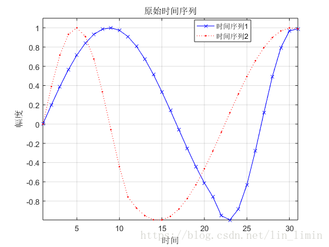
>
>   图4↑
>
>   其中`时间序列1`的前半段采样频率低于`时间序列2`前半段的采样频率，后半段高于`时间序列2`的采样频率。利用动态规划的递推公式(3)可以求得路径规整矩阵$D(i, j)$如`图5`所示。
>
>   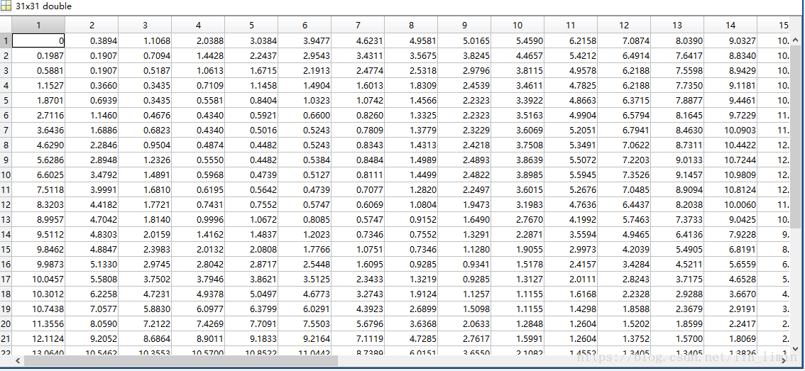
>
>   图5↑
>
>   由$D(i, j)$可得规整路径如`图6`所示。
>
>   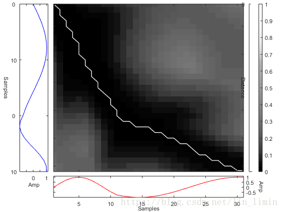
>
>   图6↑
>
>   规整路径规定了时间序列$X$与时间序列$Y$的时间对齐方式。由此可以得到如`图7`所示的规整时间序列。可见，在`DTW`的作用下，完成了两个时间序列的规整目标。
>
>   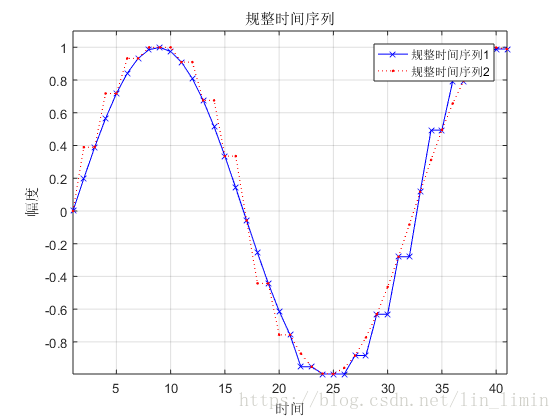
>
>   图7↑
>
>   `图7`所示的规整序列基本达到了时间序列的对齐目的。可是，如果有两个时间序列的幅值不同，将会产生什么样的规整结果？
>
>   
>
>   `图9`是对`图8`进行规整得到的规整时间序列。由此可知，最终的效果并不理想。
>
>   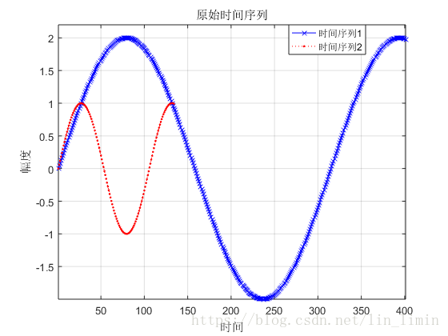
>
>   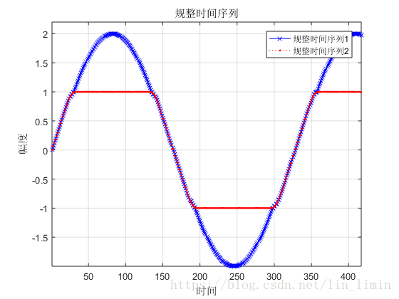
>
>   为了使得`DTW`能够提取原始序列的时间特征而忽略幅值对序列规整的影响，加入了zscore对原始数据进行标准化。最终的结果如`图10`所示。
>
>   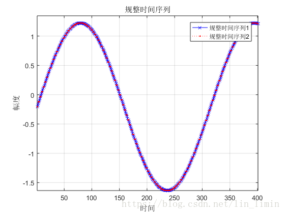
>
>   ##### 3、一个简单的单词语音音频识别实例
>
>   ###### 3.1、语音时间序列规整
>
>   自己录制的几段单词mp3文件来探讨动态时间规整算法对语音时间序列的对齐。
>
>   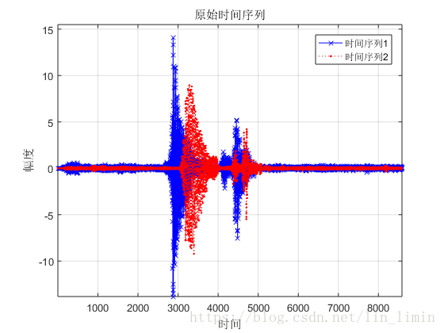
>
>   `图11`所示为两段‘water’这个单词的语音时间序列。
>
>   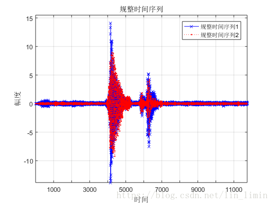
>
>   由于语速和发音时刻的差异，两个原始序列之间存在差异，但明显可以看出两者之间有很大的相似性。
>
>   利用第2小节阐述的`DTW`算法，最终的语音规整结果如`图12`所示，基本达到了目的。当然这边做的非常粗糙，比如语音里面的很多毛刺，低频信号完全可以用滤波的方式先消掉，然后再交由`DTW`进行处理。
>
>   ###### 3.2、单词语音音频识别
>
>   如何利用`DTW`算法来做简单的语音音频识别？
>
>   第2小节已经提及，`DTW`做序列规整时利用规整路径距离$D(\left| X \right|,\left| Y \right|)$来衡量时间序列$X$和时间序列$Y$的相似性。所以，假设我们现有`water`，`teacher`，`apple`的几段音频序列，要识别某一个音频的发音到底是这三个单词中的哪一个，就只需要将这个待识别音频序列分别与三个单词的音频序列做规整，得到各自的规整路径距离$D(\left| X \right|,\left| Y \right|)$（即附录代码中的变量Dist）。$D(\left| X \right|,\left| Y \right|)$越小，说明两者的相似度越高。
>
>   这样可以初步完成单词语音音频识别的任务。
>
>   当然，实际上进行这样操作的复杂度是很高的，实用性很差。
>
>   ##### 4、总结
>
>   　　① 动态时间规整算法（`DTW`）是一种时间序列对齐方法。它通过寻找一条规整路径来使得规整距离最小。规整路径距离$D(\left| X \right|,\left| Y \right|)$表征了两个时间序列的相似性：$D(\left| X \right|,\left| Y \right|)$越小，相似度越高。
>
>   　　② 可以利用`DTW`算法来做单词音频的识别。


简而言之，就是允许错开求差值，并且取最小的那个作为距离。

`DTW`的问题：

1、运算量大；

2、识别性能过分依赖于端点检测；

3、太依赖于说话人的原来发音；

4、不能对样本作动态训练；

5、没有充分利用语音信号的时序动态特性；

6、`DTW`适合于特定人基元较小的场合，多用于孤立词识别。


`DTW`距离代码在文件中是：

```python
# `DTW`距离，时间复杂度为两个时间序列长度相乘
def DTWDistance(s1, s2):
```

计算全量代价太大，时间复杂度比较高，于是进行优化，只检测前W个窗口的值。优化后的`DTW`距离在文件中是：

```python
# DTW_W距离, 优化后的算法，只检测前W个窗口的值
def DTWDistance_W(s1, s2, w):
```

之后的计算就用优化后的``DTW`Distance_W()`函数。

#### 1.3  `DTW`的主流优化手段[^2]

`DTW`出现之前对于序列相似度测测量主要基于`ED（Euclidean Distance）`。

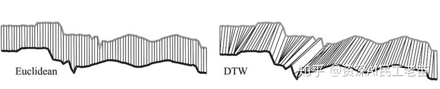

左边是`ED`算法， 只能解决时间步万全匹配的距离计算。

右面是`DTW`算法， 可以存在时间步骤之间多对一的情况。 很显然对于复杂序列，`DTW`更靠谱。


`ED`距离对于序列来说会有很多问题，比如每一个时间步不能很好对齐，或者序列长短不一等等。

 `DTW`出现以后在很多场景逐步取代ED的位置， 但`DTW`有一个很大的缺陷，就是算的慢，其算法复杂度是$O(nm)$，而`ED`只有 $O(n)$。 

随后的一系列研究成果都是围绕如何加快`DTW`的速度展开，比如寻找更好的`LB（low bound)`，创建更好的`index`简化计算， 使用部分计算代替全部计算的`early abandon`方法等等。 

自从1994年`DTW`算法最先被报道出来以来， 各种围绕`DTW`的性能和准确性优化层出不穷。 

再次重复一边`DTW`算法：

>   假设我们有两条序列 `Q（query）`和 `C (candidates)`， 分别长度为 ![[公式]](chapter01.assets/equation-163772682958613.svg+xml) 和 ![[公式]](chapter01.assets/equation-163772682958614.svg+xml) ，他们不一定相等。
>
>   ![[公式]](chapter01.assets/equationtex=Q%253Dq_1%252C+q_2%252C......%252Cq_i%252C......%252Cq_n)
>
>   ![[公式]](chapter01.assets/equationtex=C%253Dc_1%252C+c_2%252C......%252Cc_j%252C......%252Cc_m)
>
>   为了比对`Q`和`C`，组成一个`n by m`的矩阵， 每两个对齐后的元素之间的距离下标定义为 ![[公式]](chapter01.assets/equation-163772682958615.svg+xml) 距离定义为 ![[公式]](chapter01.assets/equation-163772682958616.svg+xml) 比如 ![[公式]](chapter01.assets/equation-163772682958617.svg+xml) 。 有一条 warping path 穿越这个矩阵， 定义为 ![[公式]](chapter01.assets/equation-163772682958718.svg+xml) 。 ![[公式]](https://www.zhihu.com/equation?tex=W) 的第 ![[公式]](chapter01.assets/equation-163772682958719.svg+xml) 个元素，定义为 ![[公式]](chapter01.assets/equation-163772682958720.svg+xml)。
>
>   ![[公式]](chapter01.assets/equationtex=W%253Dw_1%252C+w_2%252C+...%252Cw_k%252C+...%252C+w_K)
>
>   示意图如下：
>
>   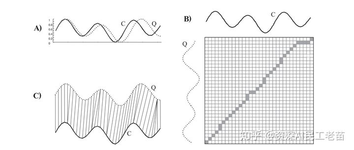
>
>   图A) 表示两条序列`Q`，`C`， 
>
>   图B) 表示两条序列对比矩阵，以及`warping path`，
>
>   图C) 表示对比结果。
>
>   `DTW`的约束条件如下：
>
>   -   Boundary conditions: ![[公式]](chapter01.assets/equation-163772682958821.svg+xml) 和 ![[公式]](chapter01.assets/equation-163772682958822.svg+xml) 表示两条序列收尾必须匹配。
>   -   Continuity: 如果 ![[公式]](chapter01.assets/equation-163772682958823.svg+xml) 且 ![[公式]](chapter01.assets/equation-163772682958824.svg+xml) 则 ![[公式]](chapter01.assets/le+1.svg+xml) 且 ![[公式]](chapter01.assets/le+1-163772682958825.svg+xml) 。 这条约束表示在匹配过程中多对一和一对多的情况只能匹配周围一个时间步的的情况。
>   -   Monotonicity: ![[公式]](chapter01.assets/le+0.svg+xml) 这条约束表示 `warping path`一定是单调增的， 不能走回头路。
>
>   当然有指数级别`warping path`满足这些约束。 
>
>   因此这个问题就变成寻找一条最优路径的问题。 
>
>   问题描述如下：
>
>   ![[公式]](chapter01.assets/right.+++)
>
>   这条最优路径可以通过动态规划的算法求解， 每个时间步的累计距离 。
>
>   ![[公式]](chapter01.assets/%7D.svg+xml)
>
>   整体算法复杂度：$O(mn)$。


##### 1.3.1 使用平方距离代替平方根距离

原生的`DTW` 和`ED`算法在在距离求解上都是用平方根距离，其实这一步可以省略。 对于搜索和排序任务， 有没有平方对于结果没影响。 但平方根求解在`CPU`底层计算开销其实很大。

##### 1.3.2 Lower Bounding 算法

主要思想是在搜索数据很大的时候， 逐个用`DTW`算法比较每一条是否匹配非常耗时。那我们能不能使用一种计算较快的近似方法计算`LB`， 通过`LB`处理掉大部分不可能是最优匹配序列的序列，对于剩下的序列在使用`DTW`逐个比较呢？也就是经过剪枝，减少运算量。

伪代码如下：

```
Algorithm Lower_Bounding_Sequential_Scan(Q)

best_so_far = infinity; 
for all sequences in database 
    LB_dist = lower_bound_distance(Ci,Q); 
        if LB_dist < best_so_far
            true_dist = DTW(Ci,Q);
            if true_dist < best_so_far
                best_so_far = true_dist;
                index_of_best_match= i;
            endif
        endif
endfor
```


对于`Lower Bounding`具体的计算方法这些年学界有很多积累。 这里只提文中提到的两种： `LB_Kim`和`LB_keogh`。


###### 1.3.2.1 LB_kim 示意图：

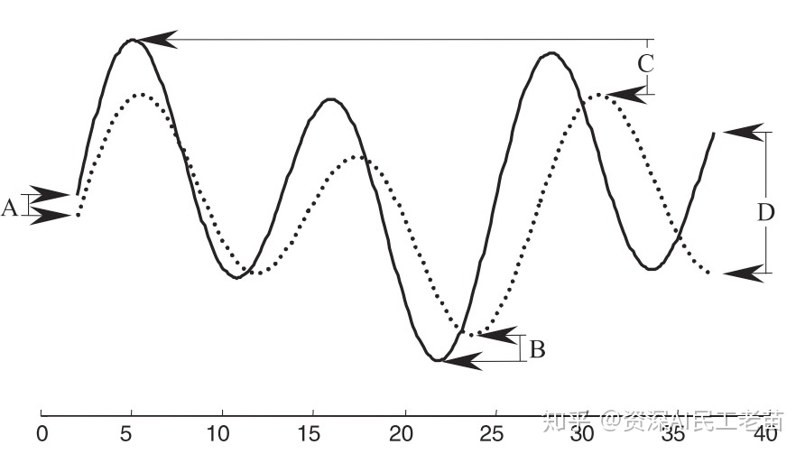

`LB_kim`的计算需要参考`Q`和`C`四个位置的距离平方。图中的A、B、C、D：

A：起始点的距离平方， 
B：`Q`，`C`最低点的距离平方， 
C： `Q`，`C`的最高点之间的距离平方， 
D：结尾处的距离平方。


###### 1.3.2.2 LB_Keogh距离

主要思想是在搜索数据很大的时候， 逐个用`DTW`算法比较每一条是否匹配非常耗时。那我们能不能使用一种计算较快的近似方法计算`LB`， 通过`LB`处理掉大部分不可能是最优匹配序列的序列，对于剩下的序列在使用`DTW`逐个比较呢？英文解释如下：

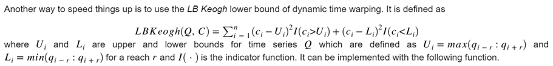

`LB_keogh`的定义相对复杂，包括两部分。

第一部分为`Q`的`{U， L} `包络曲线（具体如图）：

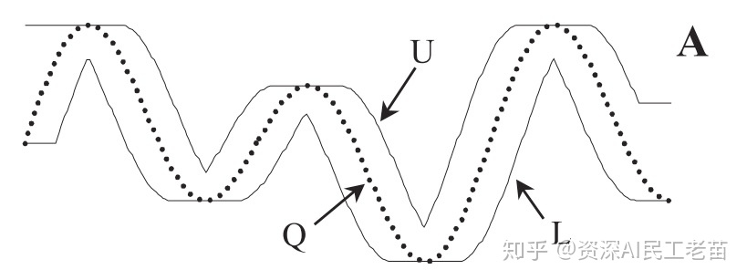


给`Q序列`的每个时间步定义上下界。 定义如下

![[公式]](chapter01.assets/equation-163772682959027.svg+xml)

![[公式]](chapter01.assets/equation-163772682959028.svg+xml)

![[公式]](chapter01.assets/le+j%252Br+.svg+xml)

其中`r`是一段滑行窗距离，可以自定义。

`U`为上包络线，就是把每个时间步为`Q`当前时间步前后`r`的范围内最大的数。`L`下包络线同理。

那么`LB_Keogh`定义如下：

![[公式]](chapter01.assets/end%7Bequation%7D+++%7D.svg+xml)

用图像描述如下：

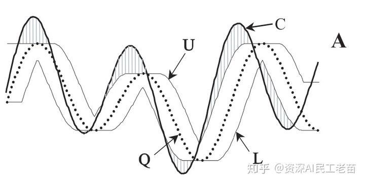

阴影部分为`LB_keogh`算法对`LB`的补偿。


###### 1.3.2.3 Early Abandoning 算法

`Early Abandoning`，提前终止算法，顾名思义，无论在使用`ED`搜索还是`LB_keogh`搜索， 每次比较都没有必要把整条序列全部比对完，当发现距离大于当前历史最好的记录时候，就可以停止放弃当前的`C序列`， 如图：

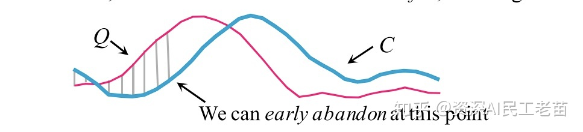

`Early Abandoning` 也可以用在`DTW`上， 并结合`LB_keogh`。 如图：

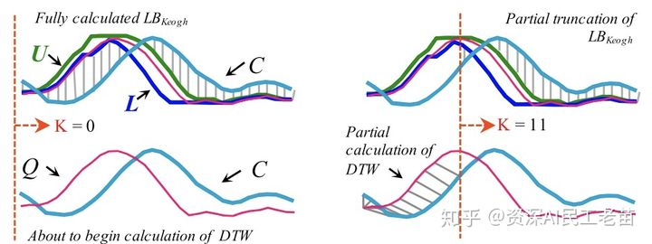


左边为计算`LB_keogh`距离， 但发现并不能通过这个距离判断是不是最优。 那么从`K=0`开始逐步计算`DTW`并且和`K`后面的`LB_keogh`部分累加，判断距离是否大于目前最好的匹配序列。

在这个过程中，一旦发现大于当前最好匹配得距离，则放弃该序列停止`DTW`。

 实际的`lower bound`可以写成：

![[公式]](chapter01.assets/equation-163772682959129.svg+xml)

`Early Abandoning`除了可以用在计算`LB`，`ED`， `DTW`上， 也可以用于对序列进行 `Z-Normalization`。

公式如下：

![[公式]](chapter01.assets/sum_%7Bi%253D1%7D%5E%7Bk-m%7D%7Bx_i%7D%7D).svg+xml)

![[公式]](chapter01.assets/mu%5E2.svg+xml)

###### 1.3.2.4 Reordering Early Abandoning 算法

这个优化的基本思想是这样的：

假如我们计算两条序列的ED距离， 为了达到Early Aandoning 的目的， 从第一个元素开始用滑窗往后尝试并不是一个最好的选择。 因为开始地序列未必区分度很强。 很可能只通过中间某一段序列就可以判断这个C不是最优匹配序列，可以提前终止算法。 示意图如下：

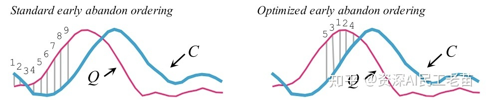


左图是是正常的从头比较。 右图是跳过一部分只比较最有区分度的一部分。

但问题来了， 如何快速的找到全局最优比较顺序呢。

 这里引入一个先验假设。 首先，每两条序列在比较之前都是要做`z-normalize`的， 因此每个时间步的数值分布应该是服从标准高斯分布。 他们的均值应该是0，因此对于距离计算贡献最大的时间步一定是远离均值0的数。 

那么我们就可以提前对序列的下标排序，从大到小依次比较，这样在计算`ED距离`和`LB_Keogh`的时候就可以尽量早的`Early abandon`，而排序过程可以再搜索之前批量完成并不影响搜索的实时性能。


###### 1.3.2.5 在计算 LB_keogh 的时候颠倒 Query/Data 的角色

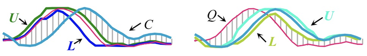

左边是给`Q序列`算上下包络线 `{U， L}`， 其实同样可以为 `C 序列`加上下包络，反过来比。

 筛选效果相同。

但是通过两种方式算出来的 ![[公式]](chapter01.assets/_keoghEC.svg+xml) 。

因此可以先用前一种方式做筛选，通过后再用后一种方式筛一遍， 更大程度的减少剩余候选序列。

###### 1.3.2.6 Cascading Lower Bounds

通过`Low Bounding`做预匹配的方式有非常多。 总体而言`Low Bounding`的计算方法也积累了很多，在不同的数据集上各有优缺点，并没有一个全局一定最好的方式。 

因此我们可以考虑把不同的`Low Bounding`的方法按照`LB(A, B)/DTW(A, B)`  的`tightness `大小层级聚合起来。从计算开销小，但是`tightness`低的`LB`， 一直到计算开销大但`tightness`高的`LB`，逐步去除无效的候选序列。 这样的好处是，用开销低的LB去掉大部分的序列， 类似起到一个从粗粒度到细粒度的清洗过程。 `LB(A, B)/DTW(A, B)`的`tightness`排序方式如图下：

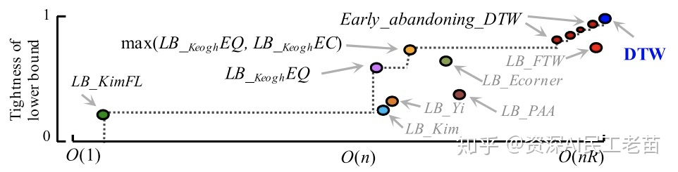

计算复杂度和接近`DTW`的距离。


自然语言处理`DTW`与一些聚类算法结合， 比如经典的`k-means`，可以把里面的距离矩阵换成`DTW`距离， 这样就可以更好的用于序列数据的聚类，而在距离矩阵的准备过程中， 也可以用到以上的各种优化思想进行性能优化。

#### 1.4  使用k-means算法实现聚类


#### 1.5 根据聚类打印出具体分类情况


### 四、结果

定义了分成两类的情形，可以根据num_clust 的值进行灵活的调整，等于2是的分类和图示情况如下：

WBC01：[6774, 7193, 8070, 8108, 8195, 2020006799, 2020007003, 2020007251, 2020007420, 2020007636, 2020007718, 2020007928, 2020007934, 2020008022, 2020008196, 2020008239, 2020008302, 2020008354, 2020008418, 2020008513, 2020008535, 2020008737, 2020008890, 2020008909, 2020009042, 2020009043, 2020009050, 2020009201, 2020009213, 2020009289, 2020009420, 2020009557]

WBC02：[2020007250, 2020007388, 2020007389, 2020007422, 2020007625, 2020007703, 2020007927, 2020009049, 2020009158, 2020009284, 2020009580]

说明：
代码训练过程中，一定要注意数据类型，比如matrix和ndarray,虽然打印的时候都是（45，30），但是再训练的时候，稍加不注意，就会导致乱七八糟的问题，需要打印排查好久。
本文的数据和代码，请登录：my github，进行下载。若是对您有用，请不吝给颗星。
具体请看博文：https://www.cnblogs.com/yifanrensheng/p/12501238.html

[^1]: https://blog.csdn.net/lin_limin/article/details/81241058
[^2]: https://zhuanlan.zhihu.com/p/86924746

