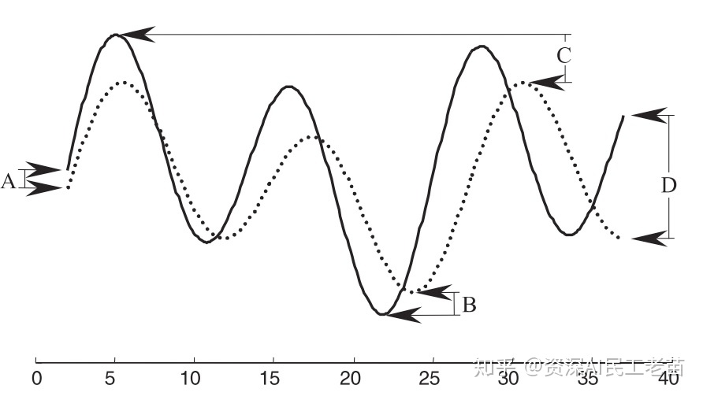
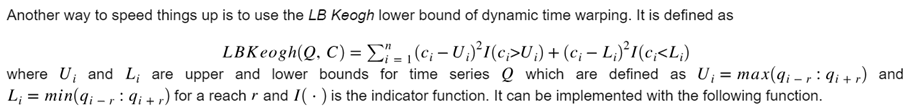
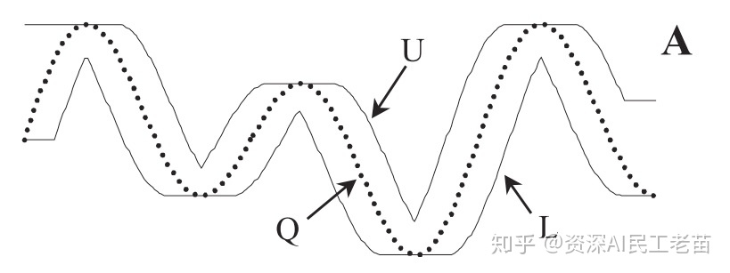
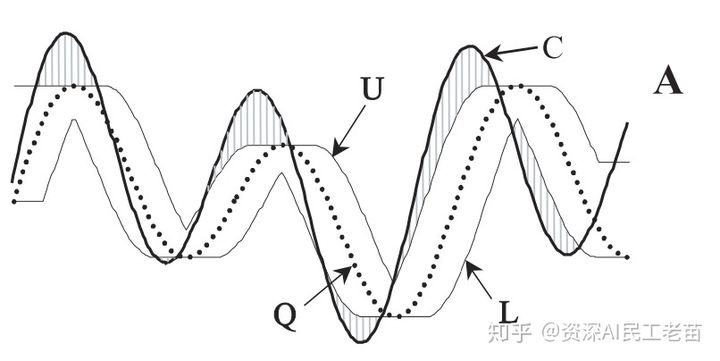
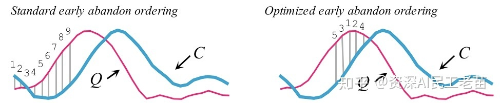

## k-means-And-DTW原理及算法介绍 Chapter02

[toc]

DTW 的适用范围极其广泛，语音识别，搜索引擎，基因组数据分析等都有 `DTW` 的身影。 

自从 1983 年 `DTW` 算法最先被报道[^1]以来， 各种围绕 `DTW` 的性能和准确性优化层出不穷。 

本文将对一个 2012 年发表的 `DTW` 性能优化算法进行解读[^2]，介绍 `DTW` 的性能优化过程。

### 二、`DTW`的主流优化手段[^3]

`DTW`出现之前对于序列相似度测测量主要基于`ED（Euclidean Distance）` ，欧拉距离。


左边是`ED`算法， 只能解决`时间同步完全匹配`的距离计算。

右面是`DTW`算法， 可以存在时间步骤之间多对一的情况。 

`ED`距离对于序列来说会有很多问题，比如每一个时间步不能很好对齐，或者序列长短不一等等。

很显然对于复杂序列，`DTW`更靠谱。


 `DTW` 算法出现以后在很多场景逐步取代 `ED` 算法的位置， 但 `DTW` 有一个很大的缺陷，就是算的慢，其算法复杂度是$O(nm)$，而`ED`只有 $O(n)$。 

随后的一系列研究成果都是围绕如何加快 `DTW` 的速度展开，比如寻找更好的`LB（low bound)`，创建更好的`index`简化计算， 使用部分计算代替全部计算的`early abandon`方法等等。 

#### 2.1 回顾 `DTW` 算法

为了讲解清楚优化方法，再次重复一遍 `DTW` 算法：

>   假设我们有两条序列 `Q（query）`和 `C (candidates)`， 分别长度为 $n$ 和 $m$ ，它们不一定相等。
>
>   ![[公式]](https://www.zhihu.com/equation?tex=Q%3Dq_1%2C+q_2%2C......%2Cq_i%2C......%2Cq_n)
>
>   ![[公式]](https://www.zhihu.com/equation?tex=C%3Dc_1%2C+c_2%2C......%2Cc_j%2C......%2Cc_m)
>
>   为了比对`Q`和`C`，组成一个`n by m`的矩阵，每两个对齐后的元素之间的距离下标定义为 ![[公式]](https://www.zhihu.com/equation?tex=%EF%BC%88i%5E%7Bth%7D%2C+j%5E%7Bth%7D%EF%BC%89) ，距离定义为 ![[公式]](https://www.zhihu.com/equation?tex=d%28q_i%2C+c_j%29) ，即 ![[公式]](https://www.zhihu.com/equation?tex=d%28q_i%2C+c_j%29%3D%28q_i+-+c_j%29%5E2) 。 
>
>   
>
>   有一条 warping path 穿越这个矩阵， 定义为 $W$ 。 
>
>   $W$ 的第 $K$ 个元素，定义为 ![[公式]](https://www.zhihu.com/equation?tex=w_k%3D%28i%2C+j%29_k)。
>
>   ![[公式]](https://www.zhihu.com/equation?tex=W%3Dw_1%2C+w_2%2C+...%2Cw_k%2C+...%2C+w_K)
>
>   示意图如下：
>
>   
>
>   图A) 表示两条序列`Q`，`C`， 
>
>   图B) 表示两条序列对比矩阵，横为`C`，纵为`Q`，以及`warping path`，
>
>   图C) 表示对比结果。
>
>   `DTW`的约束条件如下：
>
>   -   `Boundary conditions`：$w_{1}=(1, 1)$ 和 $w_{k}=(m,n)$ ，表示两条序列头尾必须匹配。
>   -   `Continuity`：如果$w_{k}=(a,b)$且$w_{k-1}=(a',b')$ ，则 $a-a'\leq 1$ 且 $b-b'\leq 1$ 。 这条约束表示在匹配过程中多对一和一对多的情况下只能匹配周围一个时间步的的情况。
>   -   `Monotonicity`： 如果$w_{k}=(a,b)$且$w_{k-1}=(a',b')$ ，则 $a-a'\geq 0$ 且 $b-b'\geq 0$ 。 这条约束表示 `warping path`一定是单调增的， 不能走回头路。
>
>   当然，有指数级别数量的 `warping path` 满足这些约束。 
>
>   
>
>   因此这个问题就变成寻找一条最优路径的问题。 
>
>   问题描述如下：
>
>   ![[公式]](https://www.zhihu.com/equation?tex=DTW%28Q%2C+C%29+%3D+min+%5Cleft%5C%7B+++++%5Csqrt%7B%5Csum_%7Bk-1%7D%5E%7BK%7D%7Bw_k%7D%7D+%5Cright.+++)
>
>   这条最优路径可以通过动态规划的算法，求解每个时间步的累计距离 ：
>
>   $$
>   \gamma(i,j)=d(q_{i},c_{j})+min\{\gamma(i-1,j-1),\gamma(i-1,j),\gamma(i,j-1)\}
>   $$
>   
>
>   整体算法复杂度：$O(mn)$。


#### 2.2 使用平方距离代替平方根距离

原生的`DTW` 和`ED`算法在在距离求解上都是用平方根距离，其实这一步可以省略。 

对于搜索和排序任务， 有没有平方对于结果没影响。 但平方根求解在`CPU`底层计算开销其实很大。

#### 2.3 Lower Bounding 算法

主要思想是在搜索数据很大的时候， 逐个用`DTW`算法比较每一条是否匹配非常耗时。

那我们能不能使用一种计算较快的近似方法计算`lower bounding distance，LB` 下界距离， 通过`LB`处理掉大部分不可能是最优匹配序列的序列，对于剩下的序列在使用`DTW`逐个比较呢？也就是经过剪枝，减少运算量。

伪代码如下：

```
Algorithm Lower_Bounding_Sequential_Scan(Q)

best_so_far = infinity; 
for all sequences in database 
    LB_dist = lower_bound_distance(Ci,Q); 
        if LB_dist < best_so_far
            true_dist = DTW(Ci,Q);
            if true_dist < best_so_far
                best_so_far = true_dist;
                index_of_best_match= i;
            endif
        endif
endfor
```


对于`Lower Bounding`具体的计算方法这些年学界有很多积累。 

Yi[^4],Kim[^5],Keogh[^6]和Zhu[^7]分别提出了支持 `DTW` 距离度量的一元时间列搜索方法。他们分别给出了各自的 `DTW` 下界距离，然后提出了支持相应下界距离的索引构建方法，并且证明搜索方法的非漏报性。

-   Yi 计算两条一元时间序列的 `DTW` 下界距离时，选择一条序列作为基准序列，以另一条序列中大于基准序列最大值的点集以及小于基准序列最小值的点集作为特征，以此为基础构造 `DTW` 下界距离，记为 `LB_Yi` 。

-   Kim 提取一元时间序列的起始点、结束点、最大值点和最小值点这4 个特征，以此为基础构造 `DTW` 下界距离，记为 `LB_Kim` 。

-   Keogh 提取查询序列的上、下边界序列作为查询特征，进而构造出一种 `DTW` 下界距离，记为 `LB_Keogh` ；使用 `PAA` 方法把数据库中的一元时间序列转换为空间向量点，用 `R-Tree` 对向量点进行组织；利用下界距离 `LB_Keogh` 在空间索引结构上执行查询，索引查询的结果构成候选集；最后，使用 `DTW` 距离计算查询序列与候选集中每个一元时间序列的 `DTW` 距离，去除不符合相似性条件的序列，得到结果集，并通过大量实验验证了 `LB_Keogh` 的紧致性优于 `LB_Yi`  和 `LB_Kim` 。

-   Zhu 对下界距离方法进行了数学证明，并提出了一种 `DTW` 下界距离，记为 `LB_Zhu` ，这可以视为 `LB_Keogh` 方法的改进，进一步提高了下界距离在索引查询中的紧致性。

-   此外,文献[^8]对时间序列进行分段累积近似，用网格最小边界矩形近似表示查询序列，进而提出一种 `DTW` 下界距离，记为 `LB_GMBR` 。


这里只提其中的两种： `LB_Kim`和`LB_keogh`。


##### 2.3.1 LB_kim 距离



`LB_kim`的计算需要参考`Q`和`C`四个位置的距离平方。图中的A、B、C、D：

A：起始点的距离平方， 
B：`Q`，`C`最低点的距离平方， 
C： `Q`，`C`的最高点之间的距离平方， 
D：结尾处的距离平方。


##### 2.3.2 LB_Keogh 距离

英文解释如下：



`LB_keogh`的定义相对复杂，包括两部分。

第一部分为`Q`的`{U， L} `包络曲线（具体如图）：




给`Q序列`的每个时间步定义上下界。 定义如下：
$$
U_{i} = max(q_{i-r}:q_{i+r})\\
L_{i} = min(q_{i-r}:q_{i+r})\\
s.t:j-r\leq i \leq j+r
$$


其中`r`是一段滑行窗距离，可以自定义。

`U`为上包络线，就是把每个时间步为`Q`当前时间步前后`r`的范围内最大的数。`L`下包络线同理。

那么`LB_Keogh`定义如下：
$$
LB\_Keogh(Q,C)=\sqrt{\sum^{i=1}_{n}
\left\{  
             \begin{array}{**lr**}  
             (c_{i}-U_{i})^{2} \quad if \  c_{i}<U_{i},  \\  
             (c_{i}-L_{i})^{2} \quad if \  c_{i}<L_{i},  \\  
             0 \quad otherwise
             \end{array}  
\right. }
$$


![[公式]](https://www.zhihu.com/equation?tex=LB%5C_Keogh%28Q%2C+C%29+%3D+%5Csqrt+%7B+%5Csum_%7Bn%7D%5E%7Bi%3D1%7D+++++%5Cbegin%7Bequation%7D+++++++%5Cleft%5C%7B++++++++++++++++%5Cbegin%7Barray%7D%7Blr%7D++++++++++++++++%28c_i+-+U_i%29%5E2++%26+%5Ctext%7Bif+%7D+c_i+%5Clt+U_i%2C+%5C%5C++++++++++++++%28c_i+-+L_i%29%5E2++%26+%5Ctext%7Bif+%7D+c_i+%5Clt+L_i+%5C%5C++++++++++++++++0+%26+%5Ctext%7Botherwise%7D++++++++++++++++++%5Cend%7Barray%7D+++++++%5Cright.+++++++%5Cend%7Bequation%7D+++%7D)

用图像描述如下：



阴影部分为`LB_keogh`算法对`LB`的补偿。


#### 2.4 Early Abandoning 算法

`Early Abandoning`，提前终止算法，顾名思义，无论在使用`ED`搜索还是`LB_keogh`搜索， 每次比较都没有必要把整条序列全部比对完，当发现距离大于当前历史最好的记录时候，就可以停止放弃当前的`C序列`， 如图：


`Early Abandoning` 也可以用在`DTW`上， 并结合`LB_keogh`。


如图：


左边为计算`LB_keogh`距离， 但发现并不能通过这个距离判断是不是最优。 那么从`K=0`开始逐步计算`DTW`并且和`K`后面的`LB_keogh`部分累加，判断距离是否大于目前最好的匹配序列。

在这个过程中，一旦发现大于当前最好匹配得距离，则放弃该序列停止`DTW`。

 实际的`lower bound`可以写成：

![[公式]](https://www.zhihu.com/equation?tex=DTW%28Q_%7B1%3AK%7D%2C+C_%7B1%3AK%7D%29+%2B+LB_%7BKeogh%7D%28Q_%7BK%2B1%3An%7D%EF%BC%8CC_%7BK%2B1%3An%7D+%29)

`Early Abandoning`除了可以用在计算`LB`，`ED`， `DTW`上， 也可以用于对序列进行 `Z-Normalization`。

公式如下：

![[公式]](https://www.zhihu.com/equation?tex=%5Cmu+%3D+%5Cdfrac%7B1%7D%7Bm%7D%28%5Csum_%7Bi%3D1%7D%5E%7Bk%7D%7Bx_i+-+%5Csum_%7Bi%3D1%7D%5E%7Bk-m%7D%7Bx_i%7D%7D%29)

![[公式]](https://www.zhihu.com/equation?tex=%5Csigma%5E2+%3D+%5Cdfrac%7B1%7D%7Bm%7D%28%5Csum_%7Bi%3D1%7D%5E%7Bk%7D%7Bx%5E2%7D+-+%5Csum_%7Bi%3D1%7D%5E%7Bk-m%7D%7Bx%5E2%7D%29+-+%5Cmu%5E2)

#### 2.5 Reordering Early Abandoning 算法

这个优化的基本思想是这样的：

假如我们计算两条序列的ED距离， 为了达到Early Aandoning 的目的， 从第一个元素开始用滑窗往后尝试并不是一个最好的选择。 因为开始地序列未必区分度很强。 很可能只通过中间某一段序列就可以判断这个C不是最优匹配序列，可以提前终止算法。 示意图如下：




左图是是正常的从头比较。 右图是跳过一部分只比较最有区分度的一部分。

但问题来了， 如何快速的找到全局最优比较顺序呢。

 这里引入一个先验假设。 首先，每两条序列在比较之前都是要做`z-normalize`的， 因此每个时间步的数值分布应该是服从标准高斯分布。 他们的均值应该是0，因此对于距离计算贡献最大的时间步一定是远离均值0的数。 

那么我们就可以提前对序列的下标排序，从大到小依次比较，这样在计算`ED距离`和`LB_Keogh`的时候就可以尽量早的`Early abandon`，而排序过程可以再搜索之前批量完成并不影响搜索的实时性能。


#### 2.6 在计算 LB_keogh 的时候颠倒 Query/Data 的角色


左边是给`Q序列`算上下包络线 `{U，L}`， 其实同样可以为 `C 序列`加上下包络，反过来比。

筛选效果相同。

但是通过两种方式算出来的 ![[公式]](https://www.zhihu.com/equation?tex=LB%5C_keoghEQ+%5Cne+LB%5C_keoghEC) 。

因此可以先用前一种方式做筛选，通过后再用后一种方式筛一遍， 更大程度的减少剩余候选序列。

#### 2.7 Cascading Lower Bounds

通过`Low Bounding`做预匹配的方式有非常多。 总体而言`Low Bounding`的计算方法也积累了很多，在不同的数据集上各有优缺点，并没有一个全局一定最好的方式。 

因此我们可以考虑把不同的`Low Bounding`的方法按照`LB(A, B)/DTW(A, B)`  的`tightness `大小层级聚合起来。从计算开销小，但是`tightness`低的`LB`， 一直到计算开销大但`tightness`高的`LB`，逐步去除无效的候选序列。 这样的好处是，用开销低的LB去掉大部分的序列， 类似起到一个从粗粒度到细粒度的清洗过程。 `LB(A, B)/DTW(A, B)`的`tightness`排序方式如图下：


计算复杂度和接近`DTW`的距离。


自然语言处理`DTW`与一些聚类算法结合， 比如经典的`k-means`，可以把里面的距离矩阵换成`DTW`距离， 这样就可以更好的用于序列数据的聚类，而在距离矩阵的准备过程中， 也可以用到以上的各种优化思想进行性能优化。


---

[^1]: D. Sankoff and J. B. Kruskal: Time Warps, String Edits, and Macromolecules: The Theory and Practice of Sequence Comparison. Addison-Wesley, Reading, MA, 1983.
[^2]: https://dl.acm.org/doi/pdf/10.1145/2339530.2339576https://link.zhihu.com/?target=https%3A//dl.acm.org/citation.cfm%3Fid%3D2339576
[^3]: https://zhuanlan.zhihu.com/p/86924746
[^4]:Yi BK, Jagadish HV, Faloutsos C. Efficient retrieval of similar time sequences under time warping. In: Proc. of the 14th Int’l Conf. on Data Engineering. 1998. 201−208. [doi: 10.1109/ICDE.1998.655778]
[^5]:Kim SW, Sanghyun P, Chu WW. An index-based approach for similarity search supporting time warping in large sequence databases. In: Proc. of the 17th Int’l Conf. on Data Engineering. 2001. 607−614. [doi: 10.1109/ICDE.2001.914875]

[^6]:Keogh E, Ratanamahatana CA. Exact indexing of dynamic time warping. Knowledge and Information Systems, 2005,7:358−386. [doi: 10.1007/s10115-004-0154-9]

[^7]:Zhu YY, Shasha D. Warping indexes with envelope transforms for query by humming. In: Proc. of the 2003 ACM SIGMOD Int’l Conf. on Management of Data. 2003. 181−192. [doi: 10.1145/872757.872780]
[^8]:Mu B, Yan JL. Efficient time series lower bounding technique. Computer Engineering and Applications, 2009,45(11):168−171 (in Chinese with English abstract).